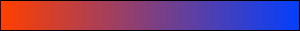
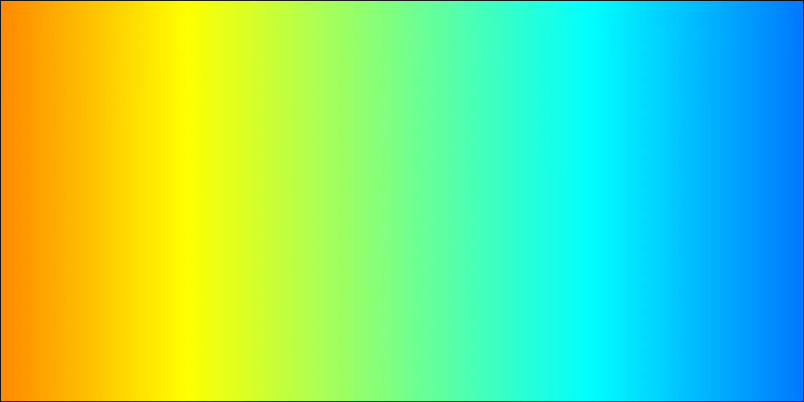

# 1c-gos-exam - ГОС Экзамен на кафедре 1С

## Задача

Предложите и реализуйте алгоритм, который позволит находить на изображении участки с градиентной заливкой (участки прямоугольной формы, стороны прямоугольника параллельны границам изображения).

## Описание


### Описаине ввода и вывода
Аргументом программе ожидается путь к картинке (тестировалось на .png)


Вывод приисходит и в консоль, и в файл. Чтобы сравнивать точные результаты лучше смотреть на пиксельные значения выведенные в консоль.
Для удобства рядом с исполняющим файлом создается файл с выделенным прямоугольником с градиентом. Внимание! выделение имеет толщину в 1px и черный цвет.
Для того, чтобы избежать неприятных ситуаций рамка может отличатся от выведенного в консоль прямоугольника на +-1px.
Можно баловаться с точностью сравнения, для этого перейдите в ```kis-gos/src/main/java/image/Pixel.java#EPS```. На данный момент он установлен в 10, можно установить в 0 и посмотреть, что будет.


### Запуск
Для запуска и тестирования необходимо иметь:
* Maven
* Java 11+


Аргументом программе ожидается путь к картинке (тестировалось на .png)


Запускать можно через:
* Idea, через запуск обычного консольного приложения, с аргументом в виде пути к файлу изображения
* Idea, через JUnit тесты. Тесты лежат в папке tests
* Через cmd.exe (заупскалку для линукса не успел написать). Аргументом будет ожидаться путь к картинке.

Чтобы запустить через консоль, нужно сначала собрать решеине мавеном:
1) Выполните ```mvn clean install```
2) В ```kis-gos/target/``` будет лежать файл ```gos.zip```
3) Распакуйте архив gos.zip в любую удобную директорию
4) Для проверки, что все сделано правильно выполните в cmd.exe: ```run.cmd img.png```
5) Рядом появится файл ```out.png``` - результат работы программы

### Решение

Для решения задачи сначала идет чтение и преобразование исходной картинки в матрицу, где каждым элементом будет пиксель, представленный в RGB.
Для этого пикселя устанавливается точность сравнения для каждого из каналов в 10 (мои тестовые картинки не были такими строгими по градиенту).

Чтобы найти прямоугольник с градиентом, можно рассмотреть картинку как матрицу. Теперь задача превращается в поиск подматрицы, с градиентной заливкой.
Из всех алгоритмов на матрицах ближе к данному - это поиск максимальной нулевой подматрицы. (вдохновиться: https://e-maxx.ru/algo/maximum_zero_submatrix, https://cp-algorithms.com/dynamic_programming/zero_matrix.html (англ), 
https://www.techiedelight.com/find-size-largest-square-sub-matrix-1s-present-given-binary-matrix/, https://leetcode.com/problems/maximal-square/solution/).
В нашем случае нужно будет вместо стека состояний, хранить его для обоих осей, потому что изменения могут быть и там, и там. Кроме того, нужно хранить состояния для каждого элемента матрицы.
Сначала рассматривается левый верхний пиксель, далле смотрим на градиент в сосдних элементах, пытаясь расширить область и т.д. В итоге на каждом шаге выбираем наибольший по площади вариант. 

В результате получаем ответ.




